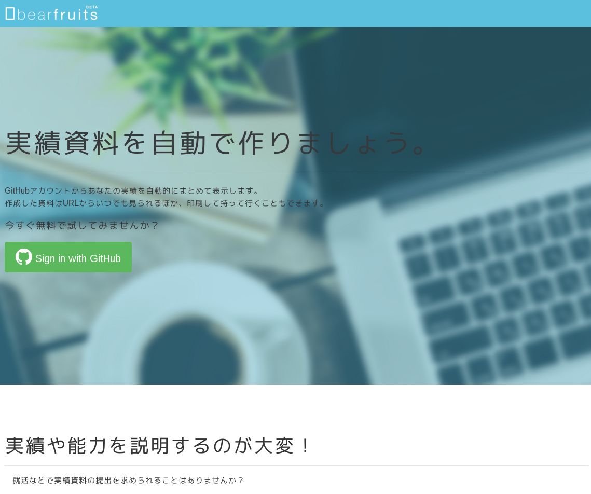

class: center, middle

 

2015/12/12 <a href="http://freestyle-mokumoku.connpass.com/event/22495/">port-mokumoku #11</a>

---

だれ?
--------

.col-xs-6[
## Pocke
A programmer.

- GitHub: [`@pocke`](https://github.com/pocke)
- Twitter [`@p_ck_`](https://twitter.com/p_ck_)
]

.col-xs-6[

.pocke-img[

]

]

---

なにはなすの?
---------

- 先日(12月10日)リリースしたWebアプリ bearfruits について話します。

---

class: center, middle

bearfruits ってなに?
---------

---

class: padding-none

---

bearfruits ってなに?
---------

- bearfruits は GitHub アカウントからあなたの実績資料を作成します!

--

- といってもピンとこないと思うので、詳しく説明します。

---

こんな経験はありませんか?
-----------

就職/転職活動で、実績の提示を求められたことはありませんか?

--

- GitHub アカウントの提示

--

- 言語の経験年数

--
- フレームワークの経験

--

- 成果物

---

こんな経験はありませんか?
--------

しかしこれらを提示する際に、いくらか問題が発生することがあります。

--

- Private レポジトリでしか活動していないため、見せることができない…

--

- 経験年数を考えるのがめんどくさい!

--

- どんな言語/フレームワークを触ってたか覚えてない…

--

- そもそも GitLab や Bitbucket を使っていて公開しづらい…

---

class: center, middle

bearfruits は 
このような問題を解決したい! 
という思いから生まれました。

---

使い方
----------

Demo

<a href="https://bearfruits.net">Go to bearfruits</a>

---

実績資料
---------

作成される実績資料は、以下の項目を含んでいます。

- 使用経験のある言語一覧とその比率
- 言語の経験年数

---

今後の機能追加予定
----------

- 使用経験のあるフレームワーク
- Pull Request / Star / Fork 数など
- コントリビューション数

---

対応予定のサービス
-----------

- GitLab
- Bitbucket
- Qiita

---

さいごに
-------

bearfruits はまだまだ発展途上のサービスです。  

--

皆様の声を聞きながら成長していきたいと考えています。

---

さいごに
-------

要望、問題点の指摘などありましたら

- [桑原(`@p_ck_`)](https://twitter.com/p_ck_)
- [小林(`@sweep3092`)](https://twitter.com/sweep3092)

のTwitterなどにお気軽にお声掛け下さい!

